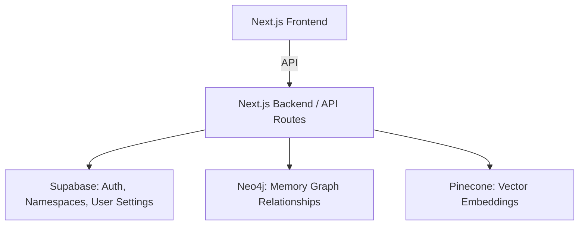

# AI Memory Management System — Phase 1 Environment & Integration PRD

**Version:** 0.3  
**Date:** 2025-11-16  
**Author:** Yonathan Daniel

---

## 1. Overview

This document outlines the **Phase 1 environment variables, integrations, database schema, and architecture** for the AI Memory Management System. It reflects the migration from MongoDB to **Neo4j**, integration with **Supabase** and **Pinecone**, and includes user authentication flows (login/signup). This PRD ensures developers have a clear guide for running and configuring the system.

The system manages memory nodes, relationships, vector embeddings, and user data for an AI personal assistant platform.

---

## 2. Phase 1 Goals

- Migrate from MongoDB → Neo4j for graph relationships.
- Integrate Supabase for **auth, user metadata, namespaces, and settings**.
- Continue using Pinecone for **vector embeddings**.
- Support basic memory operations: `create`, `update`, `extend`, `derive`.
- Provide **multi-user isolation** using Supabase namespaces and Neo4j labels.
- Provide login/signup functionality via Supabase.
- Establish clear environment variable requirements for local and cloud setups.

---

## 3. Required Environment Variables

### **3.1 Supabase**
| Variable | Purpose |
|----------|--------|
| `NEXT_PUBLIC_SUPABASE_URL` | Supabase project URL, accessible on frontend and backend. |
| `NEXT_PUBLIC_SUPABASE_ANON_KEY` | Supabase anon key for client-side auth. |
| `SUPABASE_SERVICE_ROLE_KEY` | Service role key for server-side privileged operations. **Do not expose to frontend.** |

### **3.2 Neo4j**
| Variable | Purpose |
|----------|--------|
| `NEO4J_URI` | Neo4j connection URI (Bolt or Aura cloud). |
| `NEO4J_USERNAME` | Neo4j username. |
| `NEO4J_PASSWORD` | Neo4j password. |

### **3.3 Pinecone**
| Variable | Purpose |
|----------|--------|
| `PINECONE_API_KEY` | API key for Pinecone cloud service. |
| `PINECONE_INDEX` | The name of the Pinecone index you will use for memory embeddings. |

**Note:** `PINECONE_CONTROLLER_HOST` is optional and **not required** when using Pinecone managed cloud service.

---

## 4. Example `.env.local`

```env
NEXT_PUBLIC_SUPABASE_URL=https://your-project-ref.supabase.co
NEXT_PUBLIC_SUPABASE_ANON_KEY=your-anon-key
SUPABASE_SERVICE_ROLE_KEY=your-service-role-key

NEO4J_URI=bolt://neo4j-your-cloud-url:7687
NEO4J_USERNAME=neo4j
NEO4J_PASSWORD=yourpassword

PINECONE_API_KEY=your-pinecone-api-key
PINECONE_INDEX=memory-index
```

---

## 5. Database Schema

### **5.1 Supabase Tables**

#### profiles
```text
id: uuid (PK, FK to auth.users)
display_name: text
email: text
created_at: timestamp
updated_at: timestamp
```

#### namespaces
```text
id: uuid (PK)
user_id: uuid (FK)
pinecone_namespace: text
graph_namespace: text
is_default: boolean
created_at: timestamp
```

#### user_settings
```text
user_id: uuid (PK, FK)
embedding_model: text
llm_model: text
memory_rules: jsonb
created_at: timestamp
updated_at: timestamp
```

#### auth (Supabase provided)
- login/signup, JWT tokens, password reset, etc.

**Notes:**
- Namespaces allow per-user partitioning of Neo4j and Pinecone data.  
- Settings allow user-specific LLM / embedding configurations and memory behavior rules.  
- Supabase auth handles signup/login and secure RLS for multi-user isolation.

---

### 5.2 Neo4j Graph Schema

**Nodes:**
```text
(:Memory {
  id: string,
  content: string,
  vector_id: string,
  namespace: string,
  metadata: map,
  created_at: datetime,
  updated_at: datetime
})

(:User {
  id: string
})
```

**Relationships:**
```text
(User)-[:OWNS]->(Memory)
(Memory)-[:EXTENDS]->(Memory)
(Memory)-[:UPDATES]->(Memory)
(Memory)-[:DERIVES]->(Memory)
```

**Notes:**
- `namespace` label ensures multi-user isolation  
- Supports memory versioning and lineage

---

## 6. Architecture Overview



**Responsibilities:**
- **Supabase:** User auth (login/signup), multi-tenancy, namespaces, and settings.
- **Neo4j:** Stores memory nodes and relationships (`OWNS`, `EXTENDS`, `UPDATES`, `DERIVES`).
- **Pinecone:** Stores vector embeddings for semantic search.
- **Next.js Backend:** Orchestrates memory ingestion, updates, retrieval, and API routes.
- **Next.js Frontend:** React Flow visualization of memory graph.

---

## 7. Memory Lifecycle

1. **Create**: ingest text/PDF/chat → generate embedding → store in Pinecone → create node in Neo4j → link `OWNS` to user
2. **Update**: mark previous memory as `superseded` → create updated node → link `UPDATES`
3. **Extend**: add context to existing memory → link `EXTENDS`
4. **Derive**: infer new memory based on patterns/similarity → link `DERIVES`
5. **Retrieve**: query Pinecone → traverse Neo4j subgraph → feed relevant data to LLM/frontend

---

## 8. Phase 1 Scope Summary

- Supabase integration (users, auth, namespaces, settings) including login/signup
- Neo4j integration (memory nodes, relationships)
- Pinecone integration (vector storage)
- Environment variable configuration for cloud usage
- Memory operations: `create`, `update`, `extend`, `derive`
- React Flow visualization of memory graph

**Out of scope:** Redis caching, strategic memory consolidation, multi-agent workspaces.

---

## 9. Future Enhancements

- Optional Redis layer for **active memory caching**
- Advanced memory scoring and temporal weighting
- Memory consolidation & compression
- Multi-workspace / multi-agent support
- Analytics dashboards

---

**End of PRD**

